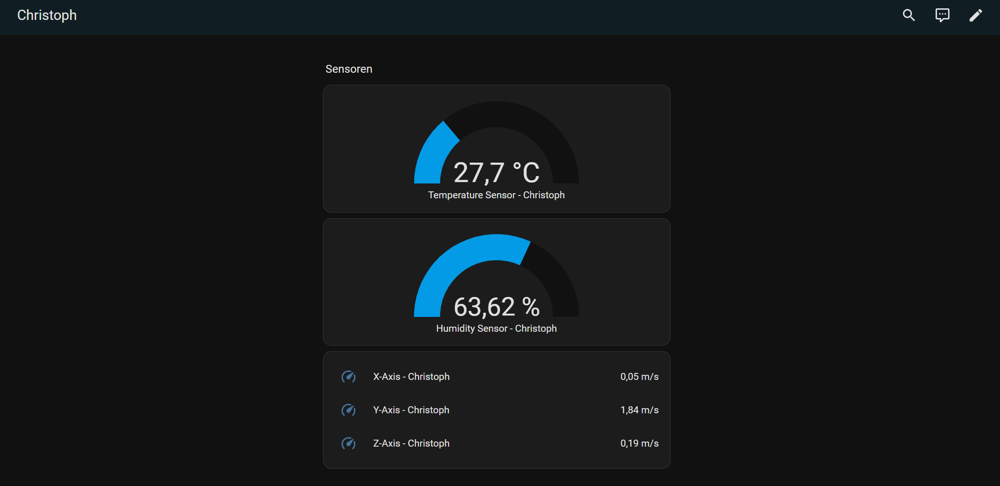

# Home Assistant Projekt
Diese Applikation liest verschiedene Sensoren aus und sendet die Daten mit MQTT an den Home Assistant.  

## Components
ESP32 Development Board  
ICM42688P Beschleunigungssensor  
SHTC3 Temperatur- und Luftfeuchtigkeitssensor  

## Code
### Main.c
Initialisierung aller Components und Erstellen der Tasks zum auslesen und senden der Daten.

### Wifi.c
Implementation der Wifi Connection.

### MQTT.c
Implementation des MQTT.

### sensors/*
Implementation der einzelnen Sensoren.

### Homeassistant

